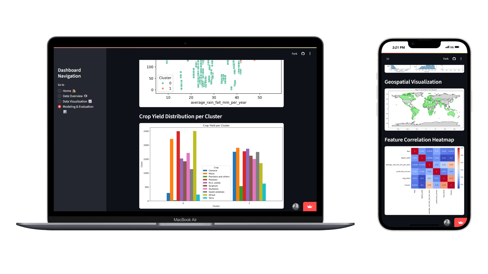

# 🌾 Crop Yield Analysis and Clustering Dashboard using K-Means Algorithm

## 🔎 About
This project focuses on the analysis and clustering of crop harvest results across several regions using the K-Means algorithm. The clustering is based on key environmental factors, particularly average rainfall and temperature, to better understand the influence of internal and external conditions on agricultural outcomes.

Project languages:
* en

Demo Link:
https://cropyieldclusteringusingkmenas.streamlit.app/

## ✨ Features
* Data overview, including dataset preview & shape, data type, and statistical summary.
* Data visualization, including scatter plot, box plot, histogram, geospatial plot & heatmap.
* Modeling and evaluation, including elbow plot and distribution & statistics of clustering result.
  
## 📦 Dependencies
|  Name  |  Version  |
|--------|-----------|
|[streamlit](https://pypi.org/project/streamlit/)|1.34.0|
|[pandas](https://pypi.org/project/pandas/)|2.3.0|
|[matplotlib](https://pypi.org/project/matplotlib/)|3.8.0|
|[seaborn](https://pypi.org/project/seaborn/)|0.13.2|
|[numpy](https://pypi.org/project/numpy/)|1.25.1|
|[scikit-learn](https://pypi.org/project/scikit-learn/)|1.4.2|
|[geopandas](https://pypi.org/project/geopandas/)|1.0.1|
|[scipy](https://pypi.org/project/scipy/)|1.15.3|

## 🖥️ Requirements
* Operating System (OS): Windows 10, Mac, Linux.
* Web Browser: Google Chrome, Microsoft Edge, Firefox, Safari.

## 🥼 Author(s) / Contributor(s)
* Wicaksono Hanif Supriyanto

## 📚 References
* Rishi Patel. Crop Yield Prediction Dataset. Kaggle. https://www.kaggle.com/datasets/patelris/crop-yield-prediction-dataset
